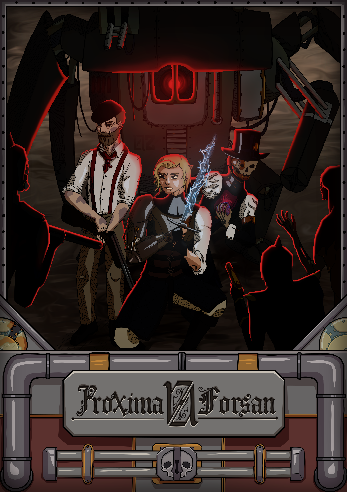

Questo documento è un manuale d’ambientazione fan-made per Savage Worlds Adventure Edition (SWADE)
ed è pensato come un (possibile) sviluppo temporale dell’ambientazione ufficiale *Ultima Forsan*, scritta da
Mauro Longo e Giuseppe Rotondo, e prodotta da GG Studio. Incoraggiamo fortemente i lettori a conoscere e
giocare l’opera originale, da cui la presente ambientazione è liberamente tratta.

Questo documento è un **PROGETTO APERTO**: rimarrà gratuito online su questa repository e verrà
mantenuto aggiornato dall’autore. Sono bene accetti i commenti di chiunque voglia proporre eventuali
migliorie, modifiche o sviluppi aggiuntivi dell’ambientazione.

L’ambientazione di *Proxima Forsan* è collocata temporalmente circa 50 anni dopo il 1515, l’anno del Grande
Concilio Universale, e a seguito degli eventi della campagna ufficiale “C’era una volta a Lucca”. Rispetto alla
storia canonica di quest’ultima, Proxima Forsan introduce alcune modifiche. Queste, assieme a qualsiasi
sviluppo e conseguenza, sono da considerarsi assolutamente non ufficiali e valide solo nel setting del presente
manuale. Si invita dunque il lettore a considerare tutti gli eventi descritti come una linea temporale a sé stante,
staccata da quella di “C’era una volta a Lucca”.
Pur essendo questo un manuale indipendente e a sé stante, per comprenderlo al meglio è necessaria una
conoscenza di base di *Ultima Forsan*. L’autore rinnova l’invito a leggere e giocare questa fantastica
ambientazione; per chi avesse bisogno di un ripasso o di un riassunto, le prime sezioni del presente documento
forniscono una sintesi degli eventi e dei concetti fondamentali di *Ultima Forsan*.

Rispetto alla semplicità di SWADE, questo manuale aggiunge qualche grado di complessità, in particolare per
quel che riguarda l’equipaggiamento ed i Poteri. In entrambi i casi si è cercata una maggiore caratterizzazione e
varietà, a discapito della facilità d’uso e gestione. Qualora questo risultasse eccessivo, il GM ed i giocatori si
sentano liberi di utilizzare piuttosto le versioni originali di SWADE, trovando i corrispettivi che meglio si
adattano al loro stile di gioco.
